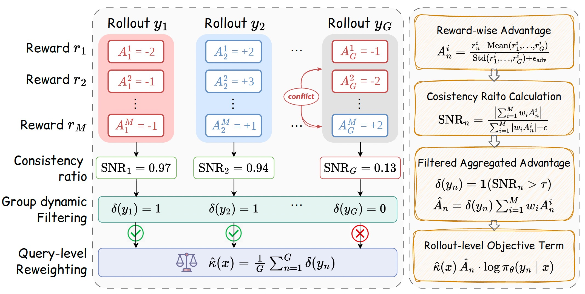

<div align="center">

## GD²PO: Group-Dynamic Reward-Decoupled Policy Optimization for Mitigating Multi-Reward RL Conflicts

<!-- Badges -->
<a></a>
<a href="https://arxiv.org/abs/2606.16771"></a>
<a href="https://github.com/Qwen-Applications/GD2PO"></a>
<a href="https://opensource.org/licenses/Apache-2.0"></a>

<p align="center">
  <i><b>  Qwen Large Model Application Team, Alibaba</b></i>
</p>

</div>

### 📖 Overview

In this project, we provide an implementation of **GD²PO** (*Group-Dynamic Reward-Decoupled Policy Optimization*), a conflict-aware multi-reward policy optimization method for LLM post-training. When multiple reward signals are aggregated, the same rollout may have positive advantages on some dimensions but negative on others, causing signals to cancel out. GD²PO addresses this by filtering conflicting rollouts before aggregation and reweighting each query's update strength based on reward consensus.

<div align="center">

</div>

We validate GD²PO on two multi-reward post-training tasks:

| Task | Directory | Description |
|------|-----------|-------------|
| **Tool Calling** | [`tool-calling/`](tool-calling/) | Multi-reward optimization with correctness, length, and format rewards |
| **Helpfulness–Safety Alignment** | [`safe-alignment/`](safe-alignment/) | Helpfulness–safety alignment with dual reward models |

---

### 🚀 Getting Started

Each task is self-contained with its own dependencies, data, and training scripts. Please enter the corresponding directory and follow its README:

#### Tool Calling

```bash
cd tool-calling
# See tool-calling/README.md for installation and usage
bash scripts/correctness_length/train_gd2po_hard.sh /path/to/model
```

#### Safe Alignment

```bash
cd safe-alignment
# See safe-alignment/README.md for installation and usage
POLICY_MODEL_PATH=/path/to/model \
RM_MODEL_PATH=/path/to/reward_model \
CM_MODEL_PATH=/path/to/cost_model \
bash scripts/run_gd2po_hard.sh
```

<!-- > 💡 **Important**: Always `cd` into the task directory before running scripts, so that Python resolves the correct `verl` module. -->

---

### 📁 Project Structure

```
├── tool-calling/                # Tool-calling task
│   ├── scripts/                 #   Training & evaluation scripts
│   ├── verl/                    #   Core framework (GD²PO implementation)
│   ├── API_Bank/                #   Evaluation toolkit
│   ├── dataset/                 #   Training and test data
│   └── README.md
├── safe-alignment/              # Safe alignment task
│   ├── scripts/                 #   Training & evaluation scripts
│   ├── verl/                    #   Core framework (GD²PO implementation)
│   ├── dataset/                 #   Training and validation data
│   └── README.md
└── README.md                    # This file
```

---

### 🙏 Acknowledgements

This codebase is built upon [verl](https://github.com/volcengine/verl), [GDPO](https://github.com/NVlabs/GDPO), [ToolRL](https://github.com/qiancheng0/ToolRL), and [Amo](https://github.com/Artessay/Amo). We thank all teams for their excellent open-source contributions.

---

### 📜 Citation

If you find our work useful, please consider citing:

```bibtex
@misc{liu2026gd2pomitigatingmultirewardconflicts,
      title={GD$^2$PO: Mitigating Multi-Reward Conflicts via Group-Dynamic reward-Decoupled Policy Optimization}, 
      author={Haotian Liu and Yihao Liu and Jingwei Ni and Siyuan Huang and Xinpeng Liu and Pengyu Cheng and Jiajun Song and Ruijin Ding and Junfeng Li and Zhechao Yu and Mengyu Zhou and Hongteng Xu and Xiaoxi Jiang and Guanjun Jiang},
      year={2026},
      eprint={2606.16771},
      archivePrefix={arXiv},
      primaryClass={cs.LG},
      url={https://arxiv.org/abs/2606.16771}, 
}
```
